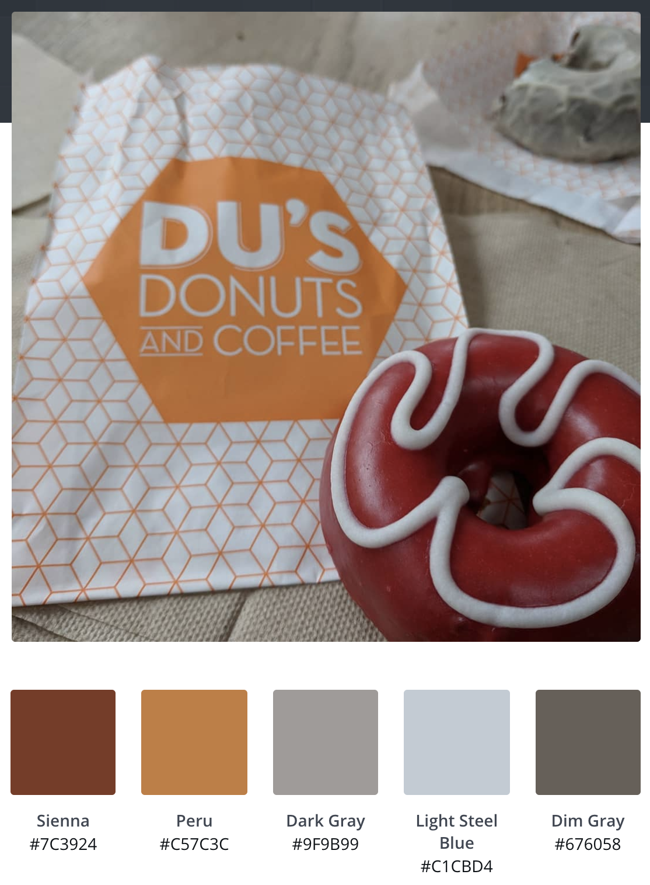

# **Assignment #1**
As most people right now, I miss being out and about and trying fun new foods/drinks. As such, I used a picture I took from a donut shop in NYC as inspiration for the assignment. I selected this photo because the colors were fun and unique, and I thought it would be an interesting theme to create a map with. 

As I studied the colors and the different features that can be customized in Google's map stylizer, I realized I could use the colors to highlight the roadways/transit. The thicker lines are highways and the thinner lines are arterial roadways (the roadways are consistent with transit lines being on or underneath these roadways). I feel this feature is what stands out the most in the map. However, I struggled with the "saturation" feature on the highways and roadways and wanted them to be lighter but I was not able to find a good balance. 

The other colors highlight parks and/or "human-made" areas (such as a large sports complex). These provided an intriguing addition of color but without being overly aggressive. Overall, this color scheme was fun to work with but I do not think it was the most impactful in relaying information. Typical/standardized color schemes seem to continue to be more effective (such as blue for water, green for parks, etc.).

After working with this Google product, I was not entirely sure how useful it would be in the future. The color customization was interesting, but it is difficult to image a situation in which an organization would like to use their theme/brand on a map that would require such customization rather than using typical color standards or the default templates Google provides; I think this because then readability and intuitiveness are lost and the map would be heavily reliant on a key of some sort (which is not generated by this tool and would have to manually be created by the map author). I can see this being most useful to highlight one aspect of a map and choosing one highlight color to quickly relay basic information, such as featuring parks in a county to show how many are within the county. 

[The JSON code can be found here.](/Burandt_JSON_Lab1_AdvancedGIS.rtf)

### [Click here to return to the main portfolio page](https://tburandt01.github.io/TaylorBurandt_AdvancedGIS/)
