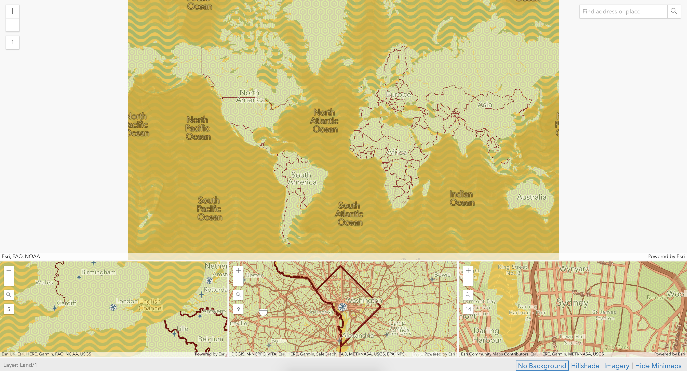

# **Custom ESRI Basemap**
My source for inspiration this week came from a streetwear brand that dropped their spring/summer line over the weekend. I thought their colors were vibrant, fun, very on brand for the season, and would be interesting to work with in a map setting. I wanted to challenge myself by making a readable/useful map with a unique color scheme. Below is the images I used for inspiration and Adobe color trend's output (photo credit to Anti Social Social Club):

I found that I somewhat succeeded in my challenge to make a readable map with a unique color scheme. (Aside from the patterns; those were left out of preference and added a fun element but would remove if using professionally). I was excited that the maps appeared relatively clear at all of the map scales that I tried, as seen in the image. As always being concerned with and excited about transportation, I was particularly happy with the roadways in that they stood out but were not overbearing. Additionally, the difference between highways and commuter roads was also very clear, but again not disruptive. Lastly, the hierarchical structure of the light green as the base of most of the land was subtle and allowed for the other features to be at the forefront.  

Between the two, I definitely preferred ArcGIS due to the familiarity with the program as well as the ability to create a base map and download it to use in future maps. This is very useful if I were to be working on a project that needed the same theme for multiple maps. However, the only downside is that ArcGIS is not free and I may not be able to use it in the future. This is one benefit of the Google Maps style, but still somewhat clunkier to use.

I think it would be interesting to try out both tools again when I have a  problem that I was attempting to solve in order to get more creative with the color scheme and/or more purposeful with some of the choices I was making in design. I did keep a road transportation theme in this exercise, but by potentially looking at something specific I may have produced more exploration of the tools offered in each map style generator. Looking forward to trying them both out again.

### [Click here to return to the main portfolio page](https://tburandt01.github.io/TaylorBurandt_AdvancedGIS/)
